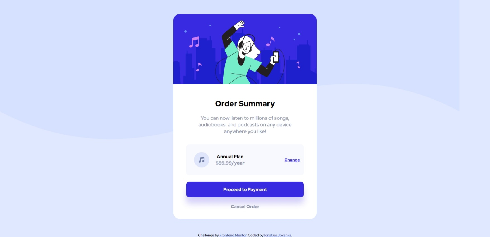

# Frontend Mentor - Order summary component solution

## Table of contents

-   [Overview](#overview)
    -   [Screenshot](#screenshot)
    -   [Links](#links)
-   [My process](#my-process)
    -   [Built with](#built-with)
    -   [What I learned](#what-i-learned)
-   [Author](#author)

## Overview

### Screenshot

### Links

-   Solution URL: [Newbie - Order summary component](https://github.com/IgnJov/Frontend-Mentor/edit/main/Newbie%20-%20Order%20summary%20component)
-   Live Site URL: [Order summary component](https://ignjov-order-summary-component.vercel.app/)

## My process

1. Determine HTML card structure
2. Determine font size and color
3. Styling layout from mobile-first toward dekstop viewport

### Built with

-   Semantic HTML5 markup
-   CSS custom properties
-   Mobile-first workflow

### What I learned

- Layouting technique
- Display flex

## Author

-   Website - [Ignatius Jovaka](https://ignjov.github.io/LnT-Personal-Portofolio/)
-   Frontend Mentor - [@IgnJov](https://www.frontendmentor.io/profile/IgnJov)
