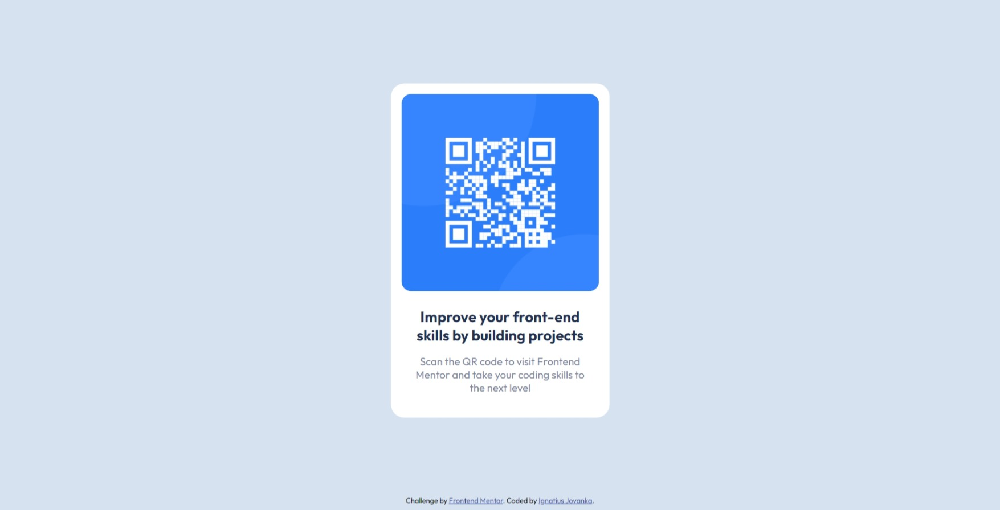

# Frontend Mentor - QR code component solution

This is a solution to the [QR code component challenge on Frontend Mentor](https://www.frontendmentor.io/challenges/qr-code-component-iux_sIO_H). Frontend Mentor challenges help you improve your coding skills by building realistic projects.

## Table of contents

-   [Overview](#overview)
    -   [Screenshot](#screenshot)
    -   [Links](#links)
-   [My process](#my-process)
    -   [Built with](#built-with)
    -   [What I learned](#what-i-learned)
    -   [Useful resources](#useful-resources)
-   [Author](#author)
-   [Acknowledgments](#acknowledgments)

## Overview

### Screenshot



### Links

-   Solution URL: [Newbie - QR code component](https://github.com/IgnJov/Frontend-Mentor/edit/main/Newbie%20-%20QR%20code%20component)
-   Live Site URL: [QR code component](https://ignjov-fm-qr-code-component.netlify.app)

## My process

1. Determine HTML card structure
2. Determine font size and color
3. Styling layout from mobile-first toward dekstop viewport

### Built with

-   Semantic HTML5 markup
-   CSS custom properties
-   Mobile-first workflow

### What I learned

I learn layouting techniques including vertical and horizontal positioning.

```css
.card {
    background-color: white;
    border-radius: 20px;
    overflow: hidden;
    padding: 16px;
    /*vertical and horizontal positioning*/
    position: absolute;
    top: 50%;
    left: 50%;
    transform: translate(-50%, -50%);
    /************************************/
    width: 300px;
}
```

### Useful resources

-   [W3schools](https://www.w3schools.com/howto/howto_css_center-vertical.asp) - This helped me figure out how to center element vertically and horizontally.

## Author

-   Website - [Ignatius Jovaka](https://ignjov.github.io/LnT-Personal-Portofolio/)
-   Frontend Mentor - [@IgnJov](https://www.frontendmentor.io/profile/IgnJov)
